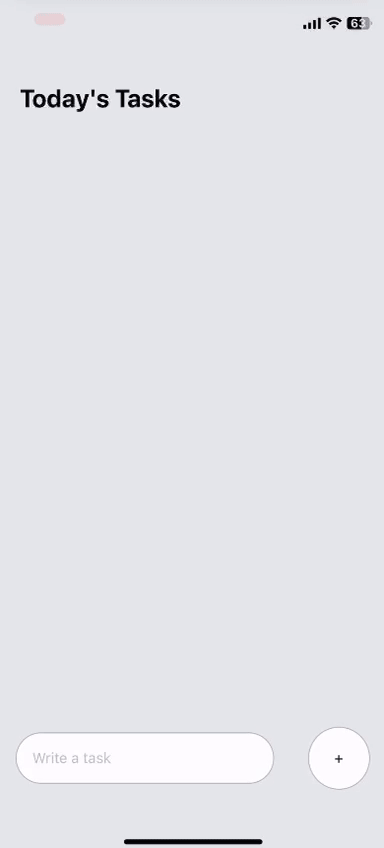

# ReactNative-ToDoList

This is an introductory project I created to familiarize myself with React Native. I have always wanted to create mobile apps, and I found React Native and Expo to be very helpful and easy to understand.

# Usage

To use this React Native/Expo project, follow these steps:

1. Clone the repository to your local machine.
2. Navigate to the project directory.
3. Install the dependencies by running the command `npm install`.
4. Start the development server with `npx expo start`.
5. Use the Expo app on your mobile device to scan the QR code displayed in the terminal or in the browser window that opens.
6. The app will be loaded on your device, and you can now interact with it.

# Demo

